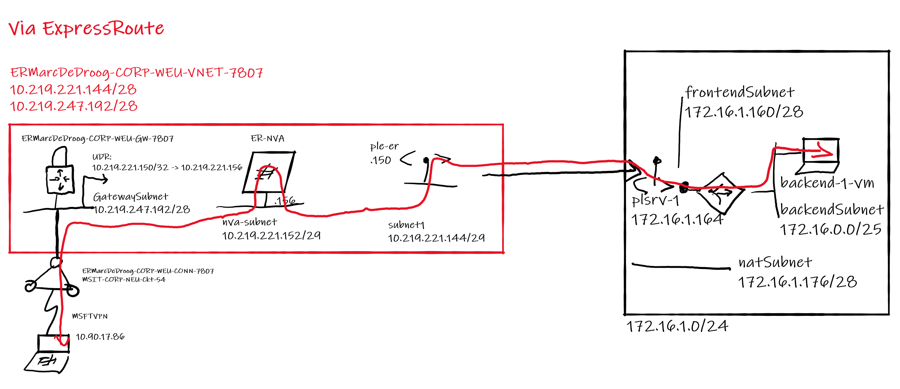
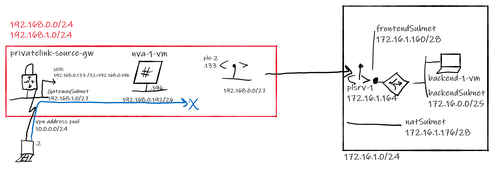
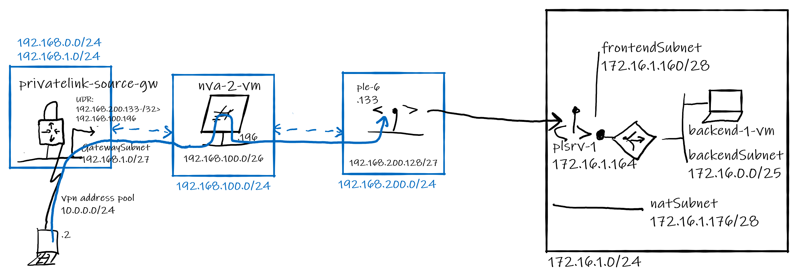

# **Routing through Network Virtual Appliances with Azure Private Link**

[Azure Private Link](https://docs.microsoft.com/en-us/azure/private-link/private-link-overview) allows resources in a VNET to privately access Azure PaaS services (such as Azure Storage and Azure SQL Database) and Azure-hosted customer- or 3rd party-owned services over Private Endpoints (PEs) projected into the VNET.

It may be necessary to inspect and control network traffic to PEs, for technical or compliance reasons. As PEs are [not compatible](https://docs.microsoft.com/en-us/azure/private-link/private-endpoint-overview#limitations) with Network Security Groups (NSGs) and User Defined Routes (UDRs), the only way to do so is to either implement NSG-based control at the traffic sources, or to route traffic for PEs through Azure Firewall or a 3rd party Network Virtual Appliance (NVA). 

Inspecting PE traffic with Azure Firewall is addressed in documentation [here](https://docs.microsoft.com/en-us/azure/private-link/inspect-traffic-with-azure-firewall). This article builds on that documentation and further explores inspecting PE traffic through an NVA, as this is a complicated subject not documented elsewhere.

# Topologies
A topology defines how a client VM, NVA and PE are arranged over VNETs. This article investigates 8 topologies.

The target resource in each topology is [Private Link Service](https://docs.microsoft.com/en-us/azure/private-link/private-link-service-overview), consisting of a VM behind a load balancer in a separate VNET. Reason for targeting Private Link Service rather than PaaS services is that it allows us to inspect traffic received inbound from the Private Endpoint. Findings described below do also apply to Private Endpoint connections to PaaS services and the lab with this articles includes Private Endpoint connections to PaaS.

## Topology #1: Single VNET
**Client VM, NVA and PE hosted in same VNET, each on a separate subnet.**

Findings:
- A UDR on the client VM's subnet is required to force traffic destined for the PE to the NVA. As each PE introduces a host (/32) System Route, a /32 User (UDR) route is required to override this System Route to force traffic for the PE address to the NVA. A less specific (summary) User route for the PE's subnet will not override the more specific System Route.
- Traffic sourced from the client VM destined for the PE, enters and exits the NVA VM but **never reaches the backend VM**. This is confirmed by observing traffic with Wireshark on the NVA and backend VM's.
- Traces from the Virtual Filter Platform (VFP) on the NVA's host machine, show the packet on the *outbound path* from the NVA VM through VFP hits a "BLOCK_ALL" rule. VFP on the NVA host silently discards the packet.

:point_right: **This topology does not work**

## Topology #2
**Client VM, NVA and PE each hosted in separate VNETs, daisy-chained with VNET peering**

Findings:
- The UDR on the client VM's subnet forcing traffic to the NVA can now contain only a summary route for the VNET that contains the PE's. As VNET peering is non-transitive and the VNET containing the PE's is two peering hops away, the host routes introduced by the PE's do not propagate to the VNET containing the client VM.
- Traffic from the client VM flows via NVA VM to the PE and reaches the backend VM. 
- Return traffic makes it back to the client VM via the NVA.
- Routing to and from the PE via the NVA is symmetrical without requiring a UDR on the PE (a UDR on the PE subnet would be ignored anyway as PE does not support UDR).

:point_right: **This topology works**

## Topology #3
**Client VM and PE in the same VNET, NVA in peered side VNET**

Findings:
- The UDR on the client VM's subnet forcing traffic to the NVA must contain a host (/32) route for the PE, pointing to the NVA in the peered VNET.
- Traffic from the client VM flows via NVA VM to the PE and reaches the backend VM. 
- Return traffic makes it back to the client VM via the NVA.
- Routing to and from the PE via the NVA is symmetrical without requiring a UDR on the PE.

:point_right: **This topology works**

## Topology #4
**Client VM and NVA in the same VNET, PE in peered VNET**

Findings:
- The host System Route introduced by the PE propagates across the peering to the client VM's subnet. A /32 User (UDR) route is required to override this System Route. A less specific User route for the PE's VNET will not override the more specific System Route.
- Traffic sourced from the client VM destined for the PE, enters and exits the NVA VM but **never reaches the backend VM**. This is confirmed by observing traffic with Wireshark on the NVA and backend VM's.
- As in topology #1, traces from Virtual Filter Platform (VFP) on the NVA's host machine show that the packet on the *outbound path* from the NVA VM through VFP hits a "BLOCK_ALL" rule. VFP on the NVA host silently discards the packet.

:point_right: T**his topology does not work**

## Topology #5
**NVA and PE in the same VNET, client VM in peered VNET**

Findings:
- The host System Route introduced by the PE propagates across the peering to the client VM's subnet. A /32 User (UDR) route is required to override this System Route. A less specific User route for the PE's VNET will not override the more specific System Route.
- Traffic from the client VM flows via NVA VM to the PE and reaches the backend VM. 
- Return traffic makes it back to the client VM via the NVA.
- Routing to and from the PE via the NVA is symmetrical without requiring a UDR on the PE.

:point_right: **This topology works**  

## VNET Gateway connections

## Topology #6
**ExpressRoute connection - VNET Gateway, NVA and PE in the same VNET**

:point_right: **This topology works**  

## Topology 7
**Site-to-site VPN connection - VNET Gateway, NVA and PE in the same VNET**

:point_right: **This topology does not work**  

## Topology 8
**Site-to-site VPN connection - VNET Gateway, NVA and PE each hosted in separate VNETs, daisy-chained with VNET peering**

:point_right: **This topology works**

## Lab

