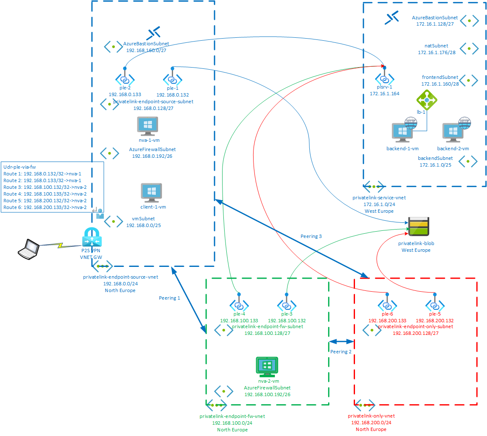

# **Routing in Azure Private Link**

[Azure Private Link](https://docs.microsoft.com/en-us/azure/private-link/private-link-overview) allows resources in a VNET to privately access Azure PaaS services (such as Azure Storage and Azure SQL Database) and Azure-hosted customer- or 3rd party-owned services over Private Endpoints (PEs) projected into the VNET.

It may be necessary to inspect and control network traffic to PEs, for technical or compliance reasons. As PEs are [not compatible](https://docs.microsoft.com/en-us/azure/private-link/private-endpoint-overview#limitations) with Network Security Groups (NSGs) and User Defined Routes (UDRs), the only way to do so is to either implement NSG-based control at the traffic sources, or to route traffic for PEs through Azure Firewall or a 3rd party Network Virtual Appliance (NVA). 

Inspecting PE traffic with Azure Firewall is addressed in documentation [here](https://docs.microsoft.com/en-us/azure/private-link/inspect-traffic-with-azure-firewall). This article builds on that documentation and further explores inspecting PE traffic through an NVA, as this is a complicated subject not documented elsewhere.

# Topologies
A topology in this article defines how a client VM, NVA and PE are arranged over VNETs. Five topologies are investigated.

The target resource in each topology is [Private Link Service](https://docs.microsoft.com/en-us/azure/private-link/private-link-service-overview), consisting of a VM behind a load balancer in a separate VNET. Reason for targeting PLS rather than PaaS services is that this allows us to inspect traffic received inbound from the PE. Findings described below do also apply to PE connections to PaaS services and the lab included with this articles includes PE connections to PaaS.

## Topology #1: Single VNET
The source VM, NVA and PE are all hosted in a single VNET, each on a seprate subnet.

Findings:
- A UDR on the client VM's subnet is required to force traffic destined for the PE, to the NVA. As PEs introduce a host (/32) System Route, this UDR must contain a /32 route for the PE address pointing to the NVA. A less specific summary route for the PE's subnet will not override the more specific System Route.
- A TCP session initiation request (SYN packet) from the client VM destined for the PE enters and exits the NVA VM guest operating system, as obeserved with Wireshark, but *never reaches the backend VM*
- Further investigation into the Virtual Filter Platform (VFP) on the NVA's host machine, reveals that the packet ooutbound from the NVA VM hits a VFP 

## Topology #2

## Topology #3

## Topology #4

## Topology #5

# Lab

